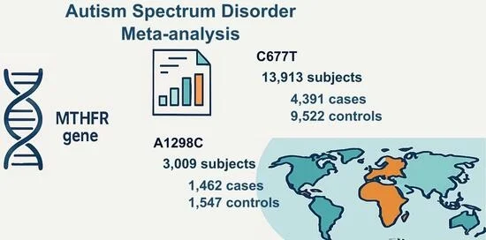

This is the analysis codes for our paper: **The Contribution of Ethnicity to the Association of MTHFR Variants C677T and A1298C with Autism Spectrum Disorder: A Meta-Analysis.**
https://doi.org/10.3390/brainsci16010093

Our study looked at the association of two MTHFR variants C677T and A1298C and ASD. We highlighted **the association between ASD and the MTHFR C677T variant**, but not A1298C. Through exploring the heterogeneity by meta-regression on race/ethnicity, we found that the **African (Egyptian) cohort with MTHFR C677T variants had a higher ASD susceptibility than Asian or European cohorts.**

This repo includes the following four major statistical analyses in the paper:
1) We **pooled odds ratio** of ASD among MTHFR C677T or A1298C homozygous individuals compared to control cohorts using a random effect model. [step1_major_analysis](step1_major_analysis)
2) **Univariate meta-regression** to identify race/ethnicity differences in the association of MTHFR C677T and A1298C with ASD. [step1_major_analysis](step1_major_analysis.R)
3) **Multiple meta-regressions** to adjust for potential study-level covariates, including publication year, diagnostic tool (DSM-IV, DSM-V, or others), and study quality, assessed as the total Newcastle–Ottawa Scale Star score. [step2_supplementary_analysis_during_revision](step2_supplementary_analysis_during_revision.R)
4) **Leave-one-out sensitivity analysis** to check robustness of the meta-analysis. [step2_supplementary_analysis_during_revision](step2_supplementary_analysis_during_revision.R)

